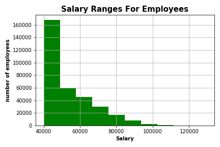
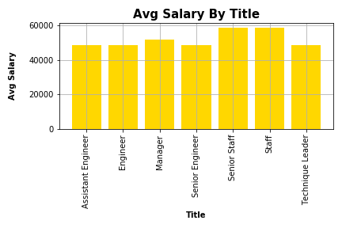

# SQL Homework - Employee Database: A Mystery in Two Parts

## Resources

  includes all the csv files of teh raw data.

 ### Data Modeling:

  included in the ERD folder

 ### Data Engineering:

  includes table schema for each of the six CSV files, data types, primary keys, foreign keys, and other constraints.
  and import each CSV file into the corresponding SQL table.

### Bonus (Optional):

 includes histogram to visualize the most common salary ranges for employees and bar chart of average salary by title.
 
### Plots

#### accidents vs rush hour

### Data Analysis
 * the salary range 40,000 to 45,000 has the highest number of employees
 * the title of satff and senior staff has the highest average salary

